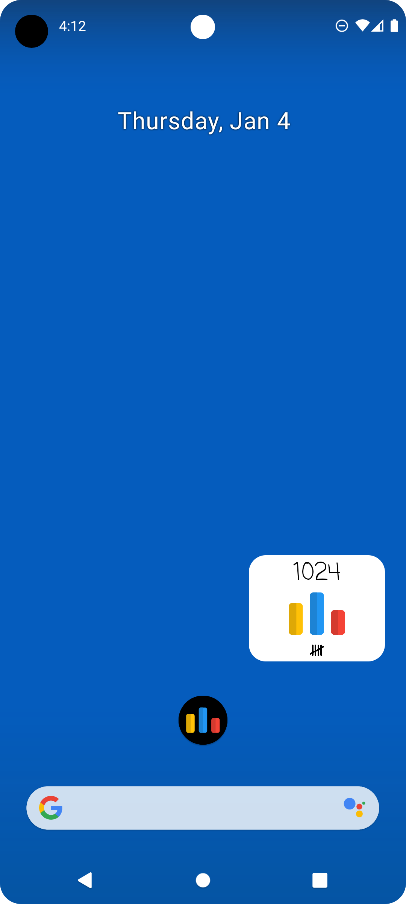

# Codeforces Widgets for Android

Provides:
- "AC Timer" widget counting up the number of seconds since the last time you solved a problem.
- Duolingo style "streak" widget with tally chart for number of problems solved each day.
